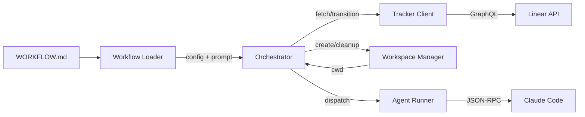

# Pyphony — Спецификация

Pyphony — long-running сервис, который поллит Linear, создает изолированные воркспейсы для каждой задачи и запускает в них Claude Code агентов.

## Архитектура



**Orchestrator** — центральный компонент. Владеет poll loop, in-memory состоянием, решает dispatch/retry/stop/release. Единственный кто мутирует scheduling state.

**Workflow Loader** — читает `WORKFLOW.md` (YAML frontmatter + Markdown prompt body). Поддерживает hot-reload без рестарта.

**Tracker Client** — Linear GraphQL клиент. Получает candidate issues, проверяет состояния для reconciliation.

**Workspace Manager** — создает директории `{workspace.root}/{issue_identifier}`, запускает lifecycle hooks (after_create, before_run, after_run, before_remove).

**Agent Runner** — рендерит prompt через Jinja2, запускает Claude Code subprocess, общается через JSON-RPC protocol, стримит события в оркестратор.

## Конфигурация (WORKFLOW.md)

```yaml
---
tracker:
  kind: linear
  api_key: $LINEAR_API_KEY
  project_slug: <slug>
  active_states: [Todo, In Progress]
polling:
  interval_ms: 30000
workspace:
  root: ~/symphony_workspaces
hooks:
  after_create: "git clone ... . && git checkout -b $(basename $PWD)"
agent:
  max_concurrent_agents: 5
  max_retry_backoff_ms: 300000
codex:
  command: claude
  turn_timeout_ms: 3600000
---
Jinja2 prompt template с {{ issue.identifier }}, {{ issue.title }} и т.д.
```

Все значения поддерживают `$ENV_VAR` подстановку. Изменения применяются динамически без рестарта.

## Стейт-машина оркестратора

Внутренние состояния задачи (не Linear-статусы):

- **Unclaimed** → задача свободна
- **Claimed/Running** → агент работает
- **RetryQueued** → ждет retry с exponential backoff
- **Released** → задача терминальная или неактивная

При нормальном завершении агента — короткий continuation retry (~1s) для проверки, осталась ли задача активной. Агент может работать несколько turns подряд (до `max_turns`).

## Reconciliation

Каждый poll tick: проверяет running задачи на stall (нет событий > `stall_timeout_ms`), отменяет задачи ставшие терминальными, чистит воркспейсы терминальных задач при старте.

## CLI

```bash
pyphony run WORKFLOW.md              # Запуск сервиса
pyphony list-candidates WORKFLOW.md  # Показать кандидатов на dispatch
pyphony check-issue WORKFLOW.md SER-1 # Почему задача не диспатчится
pyphony create-issue WORKFLOW.md --title "..." # Создать задачу
pyphony-sv WORKFLOW.md               # Supervisor: рестарт при merge
```

## Дополнительные компоненты

- **HTTP Server** (опционально, `--port` или `server.port`) — dashboard, REST API для статуса и метрик
- **Supervisor** (`pyphony-sv`) — перезапускает сервис при merge/завершении
- **Plan Required** — тикеты с лейблом «plan required» обрабатываются в режиме планирования: агент получает read-only инструменты (permission_mode: plan), исследует кодовую базу и выдаёт план реализации; по завершении лейбл заменяется на «with plan» и задача переходит в Backlog
- **Automerge** — автоматически мержит PR по лейблам
- **File Watcher** — отслеживает изменения WORKFLOW.md для hot-reload

## Детальные спецификации

- [specs/overview.md](specs/overview.md) — problem statement, goals, system overview, domain model
- [specs/workflow.md](specs/workflow.md) — WORKFLOW.md формат, конфигурация, prompt construction
- [specs/orchestration.md](specs/orchestration.md) — state machine, polling, scheduling, reconciliation
- [specs/workspace.md](specs/workspace.md) — workspace management, hooks, safety invariants
- [specs/agent-protocol.md](specs/agent-protocol.md) — agent runner, JSON-RPC protocol, app-server integration
- [specs/tracker.md](specs/tracker.md) — Linear GraphQL client, normalization, error handling
- [specs/observability.md](specs/observability.md) — logging, metrics, HTTP server, dashboard API
- [specs/operations.md](specs/operations.md) — failure model, recovery strategy, security
- [specs/reference.md](specs/reference.md) — reference algorithms, test matrix, implementation checklist
